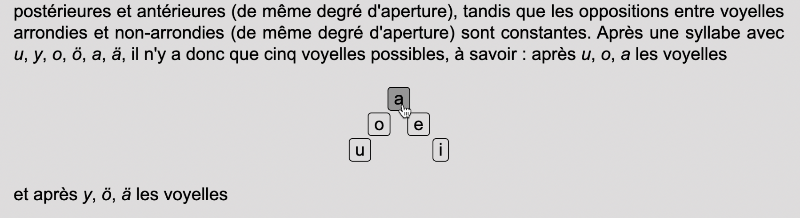
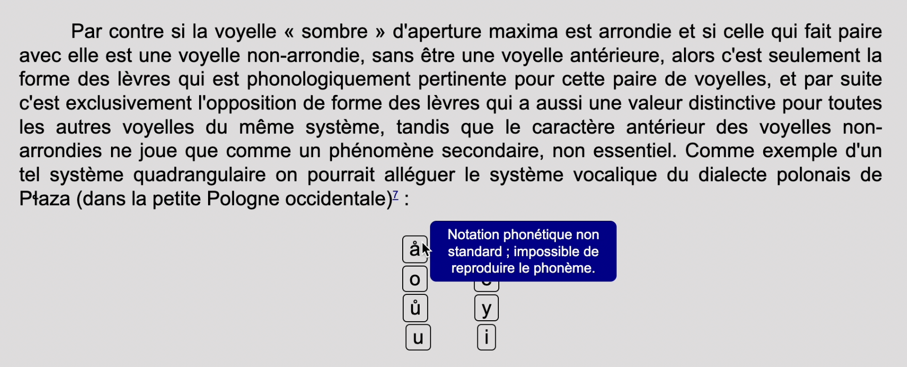

# Principes de phonologie (N. Troubetzkoy) avec sons

## Description

Traditionnellement, *scroll to the top* les livres de phonétique et de phonologie, pour plus complets qu'ils soient dans leur description des phonèmes, ne permettent pas au lecteur ou à la lectrice d'entendre les phonèmes en question. L'objectif du présent projet est de permettre l'écoute des voyelles évoquées dans le troisième chapitre du livre *Principes de phonologie* (1949), de Nikolai Troubetzkoy, afin de mieux les saisir.  
### Entendre les phonèmes
Toutes les voyelles présentes dans ce chapitre, et notées de façon standard d'après les conventions de l'[API](https://fr.wikipedia.org/wiki/Alphabet_phon%C3%A9tique_international) (Alphabet Phonétique International), sont associées à un bouton ; lorsqu'un clique est réalisé sur ce bouton, le phonème vocalique est reproduit.  
  
L'auteur n'a hélas pas noté toutes les voyelles d'après les conventions adoptées dans l'API. Ainsi, dans les cas où la voyelle n'est pas notée de façon standard, un message indicant l'impossibilité de reproduire le phonème s'affiche lorsque la souris est positionnée sur la voyelle.  
 
Finalement, un bouton *scroll to the top* devient visible lorsque l'utilisateur ou utilisatrice descend la page, et chaque note mise par l'auteur est ancrée  

## Accéder au projet
Windows et MacOS 
1. Téléchargez le fichier zip et décompressez-le dans un dossier ;
2. Cliquez deux fois sur le fichier *index.html*. 

Ou  

Cliquez ici (lien vers le site ...)

## Sources 
Le texte comprend les parties A et B du troisième chapitre du livre <i>Principes de phonologie</i> de Nikolai Troubetzkoy (pages 100-112) :  **Troubetzkoy, N. S. (1949). *Principes de phonologie*. Traduit par J. Cantineau. Paris : Librairie C. Klincksieck, 392pp.** Disponible [ici](https://ia802706.us.archive.org/22/items/principesdephono00trub/principesdephono00trub.pdf). 
Tous les sons des voyelles ont été téléchargés depuis [Wikipédia - IPA vowel chart with audio](https://en.wikipedia.org/wiki/IPA_vowel_chart_with_audio). 
Le bouton vers le haut de la page a été largement inspiré de [W3Schools - Scroll back to the top button](https://www.w3schools.com/howto/howto_js_scroll_to_top.asp). 

## Contexte de développement 
Ce projet a été développé dans le cadre du cours "Publication numérique" (2021) dispensé par Isaac Pante (SLI, Lettres, UNIL).